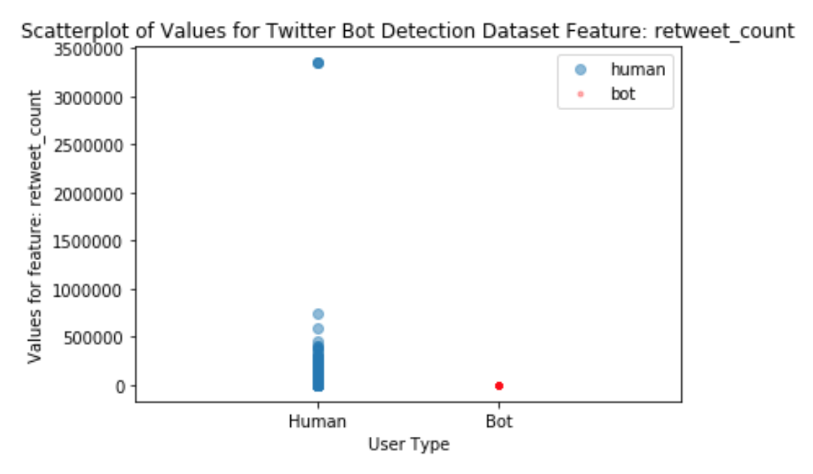
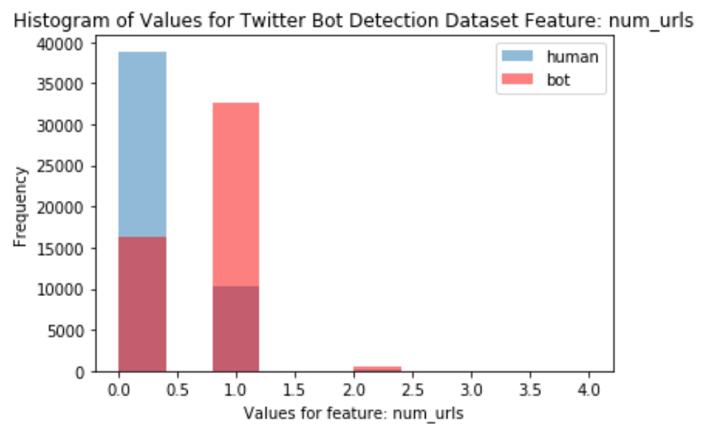
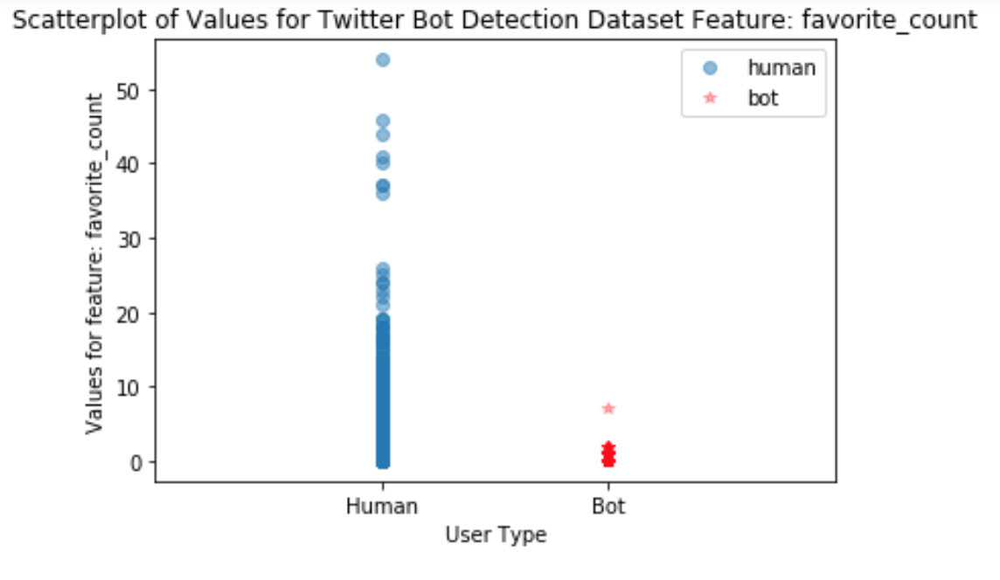
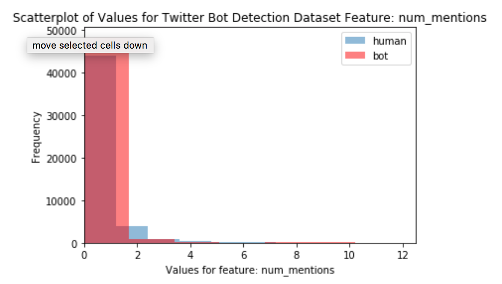
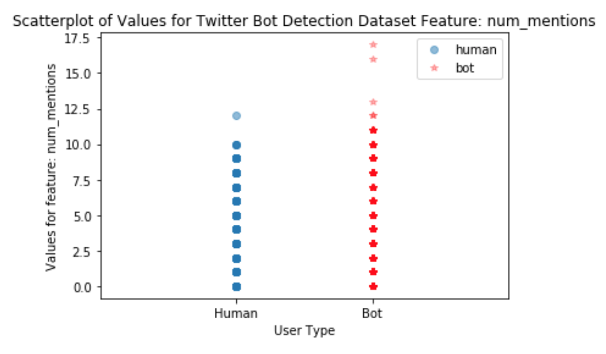

To drive our bot detection classifiers, our primary focus was to identify the most important features from
the tweets dataset.

#### Summary of EDA Results

Table 1, below, lists the features selected as a result of the EDA performed in this project.


|Features|Description|
|:-------|:----------|
|favorite count|count # of likes|
|num hashtags|# of hashtags used in tweet|
|num urls|# of urls used in tweets|
|num mentions|# of mentions of your username|
|retweet count|# of retweets|

**Table 1: Base Features Selected**

#### Data Collection

We decided to use the Twitter dataset from the My Information Bubble (MIB) Research Group [5].
We randomly selected a subset of human and bot tweets to ensure we could train and
test our models with limited compute resources.

The dataset contained individual tweet event content, metrics derived from the text of the tweet and user data. The data had the following schema:

```['id', 'text', 'source', 'user_id', 'truncated', 'in_reply_to_status_id',
       'in_reply_to_user_id', 'in_reply_to_screen_name', 'retweeted_status_id',
       'geo', 'place', 'contributors', 'retweet_count', 'reply_count',
       'favorite_count', 'favorited', 'retweeted', 'possibly_sensitive',
       'num_hashtags', 'num_urls', 'num_mentions', 'created_at', 'timestamp',
       'crawled_at', 'updated', 'user_type', 'counts']
```

#### Creating The Data Sample

One technical problem we encountered was an out of memory error when processing
the nearly 1GB tweets.csv file. Our workaround was to
read in small chunk sizes. Even though this was a relatively clean dataset, we
still encountered empty fields and 'NA' in the user\_id column which we
cleaned.

The processing of traditional bots was slightly different from
processing human tweets because the language field in the traditional
bot dataset was empty. We employed language detection modules to scan
the name, location, and description column to detect if the user was an
English Language Twitter users. This step was necessary to prepare the
data for NLP technique application. Social spam bots are built to mimic
human users, so we were able to use the human sample extraction code on
these bots.

We added our classification response variable, called 'user\_type' to
tweet-level datasets. The user_type was set as
a Boolean field and indicated a human if 1 and a bot if 0. We used this field for stratified sampling when generating train/test/validation datasets.


#### EDA and Feature Selection for Tweet-Level Data

Results of feature analysis indicated that the most useful fields for
our classification efforts were: **retweet count, favorite count, num
hashtags, num urls, and num mentions and sentiment\_negative**.
Analyzing the .info() output shows us that five of the features are empty
or have 0 for every value and we will drop these from the dataset:
'geo', 'contributors', 'favorited', 'possibly\_sensitive', 'retweeted', 'reply\_count'.

Since we did not perform any network analysis, we dropped
'in\_reply\_to\_status\_id', 'in\_reply\_to\_user\_id', and
'retweeted\_status\_id', which are fields that can be used to
reconstruct communications connectivity of an individual tweet. Other
fields that we removed were id source, created\_at, crawled\_at, and
updated. Since we are not performing temporal analysis, we
removed the timestamp.

No linear relationships between features were identified by plotting correlation matrices.  Pairplots generated for the remaining 14 features. did not identify any non-linear correlation.

Next, data were plotted to identify features
that would help the models discriminate between the two classes. The
following are plots for features with the strongest predictive value.

The values seen in “retweet\_count“ for human versus bot users is visualized in Figure 1.


<center></center>

<center> Figure 1: Retweet Count Histogram </center>


The retweet\_count feature takes on multiple values for human users, but for bots most values are nearly 0. Perhaps bots are boosting media,
rather than creating original content that others also want to retweet.


A histogram of frequency of “Num\_urls” values per user is seen in Figure 2.

<center></center>
<center> Figure 2: Num Urls Histograms </center>

The plot indicates that bots had more tweets with 1 url, whereas humans had more tweets with 0 urls. Again, the purpose of the bot is to boost a particular site or message, which means the tweet should be boosting a URL.

The plot of values for favorite\_count in Figure 3, show that humans had a greater range of values for favorite_count than bots.


<center></center>
<center> Figure 3: Favorite Count Scatterplots </center>


Again, the bots were likely boosting media, and not creating new content that users would favorite.

The final predictor of this set was the Num\_mentions feature.


<center></center>
<center> Figure 4: Num_mentions Histogram </center>


The histogram in Figure 4 shows a small area where humans have a higher density of users with num_mentions of 2, and at the upper extreme where only bots have num_mentions.  The values where only bots take on values is easier to visualize in the scatterplot of num_mentions values in Figure 5.

<center></center>
<center> Figure 5: Num\_mentions Scatterplot </center>


To further identify strong base predictors, we also performed filtering of low variance features by using
sklearn's variance threshold method which further identified the following
features to be used as baseline features: *retweet\_count, favorite\_count, num\_hashtags, num\_urls,
num\_mentions*.
