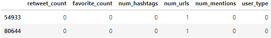
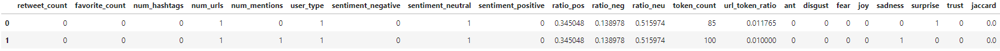
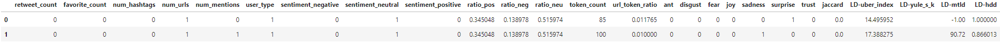
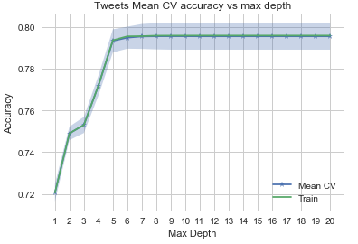
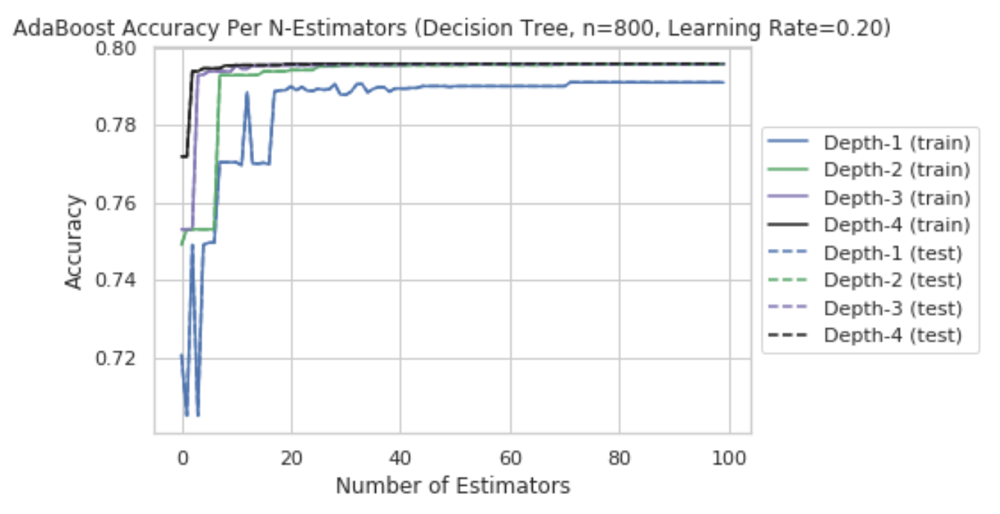
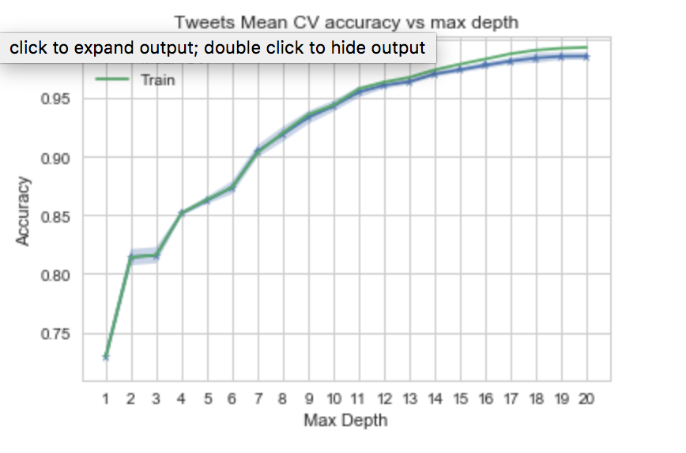
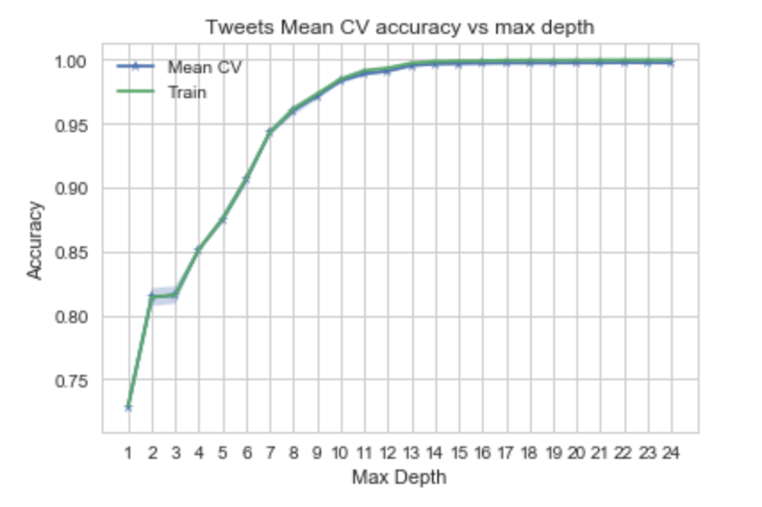
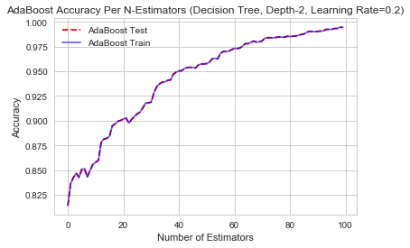
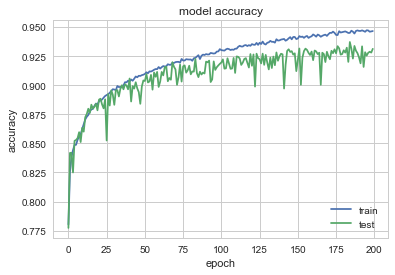

## Baseline, NLP features, Lexical Diversity

Based on EDA and feature selection, we chose the following baseline features, NLP and Lexical Diversity features. Please refer back to EDA and NLP pages for more details about the selected features. Our approach was to start with the baseline model, then add the NLP features to see if the accuracy improved, and then we added the Lexical Diversity features to improve the model even more. The description below follows a similar trend.

|Baseline features|NLP features|Lexical Diversity features|
|:----------------|:-----------|:-----------|
|retweet_count|sentiment_negative|LD-log_ttr|
|favorite_count|sentiment_neutral|LD-uber_index|
|num_urls|sentiment_positive|LD-yule_s_k|
|num_mentions|token_count|LD-mtld|
|num_hashtags|url_token_ratio|LD-hdd|
| |ratio_neg|
| |ant|
| |fear|
| |joy|
| |trust|
| |jaccard|


### Sample input data
##### Baseline


##### Baseline + NLP


##### Baseline + NLP + Lexical Diversity


### KNN
##### kNN with Baseline features
We have a fairly large number of tweets (over 100K). kNN takes forever to run. We decided drop the kNN from further evaluation.  

```python

Xs_train, Xs_test = scale(X_train), scale(X_test)

neighbors, train_scores, cvmeans, cvstds, cv_scores = [], [], [], [], []
for n in range(1,11):
    neighbors.append(n)
    knn = KNeighborsClassifier(n_neighbors = n)
    train_scores.append(knn.fit(X_train, y_train).score(X_train, y_train))
    scores = cross_val_score(estimator=knn,X=Xs_train, y=y_train, cv=5)
    cvmeans.append(scores.mean())
    cvstds.append(scores.std())
```

### Logistic Regression
#### Logistic Regression (Cross Validated) with Baseline features
Logistic Regression could only achieve a test accuracy of 74%.

```python
model_log_cv_base = LogisticRegressionCV(cv = 5).fit(xtrain_base, ytrain_base)

train_score_logcv_base = model_log_cv_base.score(xtrain_base, ytrain_base)
test_score_logcv_base = model_log_cv_base.score(xtest_base, ytest_base)
print("Log Regression Model Accuracy with Base Features (Train) is ",train_score_logcv_base)
print("Log Regression Model Accuracy with Base Features (Test) is ",test_score_logcv_base)
```

  Log Regression Model Accuracy with Base Features (Train) is  0.7662645518405441
  Log Regression Model Accuracy with Base Features (Test) is  0.7640225772312654


### LDA/QDA
#### LDA/QDA with Baseline Features
LDA and QDA performed poorly. They are in the range of 71-75% accuracy.

```python
X_train, y_train = train_base_tweets_df.drop('user_type',axis=1), train_base_tweets_df['user_type']
X_test, y_test = test_base_tweets_df.drop('user_type',axis=1), test_base_tweets_df['user_type']

lda = LinearDiscriminantAnalysis().fit(X_train, y_train)
qda = QuadraticDiscriminantAnalysis().fit(X_train, y_train)
```
LDA Model Accuracy with Base Features --> LDA score: 0.715240, CV score: 0.716122
QDA Model Accuracy with Base Features --> QDA score: 0.753943, CV score: 0.754397


### Decision Tree/RandomForest
#### Decision Tree/RandomForest with Baseline Features
The Decision Tree performed well here. After tree depth = 7, the accuracy is not improving.
We pick 7 as the optimal tree depth for RandomForest. Given the tree accuracy is fairly
constant, the accuracy is ~ 79% for both models.

```python
depths, train_scores, cvmeans, cvstds, cv_scores = [], [], [], [], []
for depth in range(1,21):
    depths.append(depth)
    dt = DecisionTreeClassifier(max_depth=depth)
    train_scores.append(dt.fit(X_train, y_train).score(X_train, y_train))
    scores = cross_val_score(estimator=dt, X=X_train, y=y_train, cv=5)
    cvmeans.append(scores.mean())
    cvstds.append(scores.std())
```


```python
fitted_rf = RandomForestClassifier(n_estimators=7, max_depth=7).fit(X_train,y_train)
random_forest_train_score = fitted_rf.score(X_train, y_train)
random_forest_test_score = fitted_rf.score(X_test, y_test)
```

Accuracy with Baseline Features --> 0.79


#### AdaBoost with Baseline Features

We tuned the parameters of the AdaBoost model and picked a Learning Rate of 0.2, Depth of 2, and 100 estimators to balance accuracy with complexity.



Using those parameters, the AdaBoost model achieved 79% accuracy on the baseline features; only slightly better than Logistic Regression.

```python

```python
#modified from lab 9 notes
def adaboost_build_and_plot(data_tuple, max_depth, n_estimators, learning_rate, makeplot=False, title_or=''):
    X_train = data_tuple[0]
    y_train = data_tuple[1]
    X_test = data_tuple[0]
    y_test = data_tuple[1]

    if len(title_or) > 0:
        title = title_or
    else:
        title = 'AdaBoost Accuracy Per N-Estimators (Decision Tree, Depth-' + str(max_depth) + ', Learning Rate=' + \
                str(learning_rate) + ')'

    skadaboost = AdaBoostClassifier(base_estimator=DecisionTreeClassifier(max_depth=max_depth),
                              n_estimators=n_estimators, learning_rate=learning_rate)
    skadaboost.fit(X_train, y_train)
    print('AdaBoost Accuracy (train)', skadaboost.score(X_train, y_train))
    print('AdaBoost Accuracy (test)', skadaboost.score(X_test, y_test))

    if makeplot == True:

        staged_scores_test = skadaboost.staged_score(X_test, y_test)
        staged_scores_train = skadaboost.staged_score(X_train, y_train)
        plt.figure()
        plt.plot(np.arange(0,n_estimators),list(staged_scores_test), label='AdaBoost Test', linestyle='dashed', color='r')
        plt.plot(np.arange(0,n_estimators),list(staged_scores_train), label='AdaBoost Train', color='b', alpha = 0.6)
        plt.title(title)
        plt.xlabel('Number of Estimators')
        plt.ylabel('Accuracy')
        plt.legend()

t0 = time()
adaboost_build_and_plot(splits['base'], 2, 100, 0.2, makeplot=True)
print("done in %0.3fs." % (time() - t0))
```


    AdaBoost Accuracy (train) 0.7955792191029364
    AdaBoost Accuracy (test) 0.7955792191029364
    done in 7.316s.


#### Neural Net with Baseline Features

##### Neural Network without NLP

In this section we try to use Keras to build a layered Neural Net.
We will use a fully-connected network structure with five layers.

Fully connected layers are defined using the Dense class.

We will use the sigmoid activation function on the first layer,softmax activation in the next, rectifier (‘relu‘) activation function on the next two layers and the sigmoid function in the output layer. We use a sigmoid on the output layer to ensure our network output is between 0 and 1 and easy to map to either a probability of class 1 or snap to a hard classification of either class.

We can piece it all together by adding each layer. The first layer has 100 neurons and expects 5 input variables. The second hidden layer has 300 neurons, the third has 100 and the fourth has 50 neurons,respectively.Finally, the output layer has 1 neuron to predict the class (bot or not).
We got a mere accuracy of 79%


```python
all_tweets_df_no_nlp = all_tweets[['retweet_count', 'favorite_count', 'num_hashtags', 'num_urls', 'num_mentions','user_type']].sample(frac=.30)
train_base_tweets_df_no_nlp, test_base_tweets_df_no_nlp = train_test_split(all_tweets_df_no_nlp, test_size=0.33, random_state=42, stratify=all_tweets_df_no_nlp['user_type'])

X_train_no_nlp, y_train_no_nlp = train_base_tweets_df_no_nlp.drop('user_type',axis=1), train_base_tweets_df_no_nlp['user_type']
X_test_no_nlp, y_test_no_nlp = test_base_tweets_df_no_nlp.drop('user_type',axis=1), test_base_tweets_df_no_nlp['user_type']

model = Sequential([
    Dense(100, input_shape=(5,), activation='sigmoid'),
    Dense(300, activation='softmax'),
    Dense(100, activation='relu'),
    Dense(50, activation='relu'),
    Dense(1, activation='sigmoid')
])

model.compile(loss='binary_crossentropy', optimizer='adam', metrics=['accuracy'])
model.summary()
```


    _________________________________________________________________
    Layer (type)                 Output Shape              Param #   
    =================================================================
    dense_21 (Dense)             (None, 100)               600       
    _________________________________________________________________
    dense_22 (Dense)             (None, 300)               30300     
    _________________________________________________________________
    dense_23 (Dense)             (None, 100)               30100     
    _________________________________________________________________
    dense_24 (Dense)             (None, 50)                5050      
    _________________________________________________________________
    dense_25 (Dense)             (None, 1)                 51        
    =================================================================
    Total params: 66,101
    Trainable params: 66,101
    Non-trainable params: 0
    _________________________________________________________________


```python
history=model.fit(X_train_no_nlp, y_train_no_nlp, epochs=200, batch_size=25, validation_split = .2)
```
accuracy for Baseline Neural Network: 79.02%

### Evaluate Model Accuracy for Extended Features (Baseline + NLP Features + Lexical diversity Features)
Next we used the same model techniques used on the baseline features on the extended features (baseline and NLP features. We observed that accuracy improved for most models with the addition of NLP features.

#### Input data with Features for NLP and Lexical Diversity
```python
all_tweets_df = all_tweets[['retweet_count', 'favorite_count', 'num_hashtags', 'num_urls', 'num_mentions',
                               'user_type', 'sentiment_negative', 'sentiment_neutral', 'sentiment_positive',
                               'ratio_pos', 'ratio_neg', 'ratio_neu', 'token_count', 'url_token_ratio', 'ant',
                               'disgust', 'fear', 'joy', 'sadness', 'surprise', 'trust','jaccard','LD-uber_index','LD-yule_s_k','LD-mtld','LD-hdd']]
```


#### Logistic Regression (Cross Validated) with Extended Features
##### Logistic Regression (Cross Validated) with NLP features
We were able to bring the accuracy a little bit up to 82.47% after adding the NLP
 features

```python
model_log_cv = LogisticRegressionCV(cv = 5).fit(xtrain_nlp, ytrain_nlp)

train_score_logcv_nlp = model_log_cv.score(xtrain_nlp, ytrain_nlp)
test_score_logcv_nlp = model_log_cv.score(xtest_nlp, ytest_nlp)
print("Log Regression Model Accuracy with NLP (Train) is ",train_score_logcv_nlp)
print("Log Regression Model Accuracy with NLP (Test) is ",test_score_logcv_nlp)
```

  Log Regression Model Accuracy with NLP (Train) is  0.8250179958795641
  Log Regression Model Accuracy with NLP (Test) is  0.824749281862621


##### Logistic Regression (Cross Validated) with NLP and Lexical Diversity features
Next we added Lexical Diversity features to the mix and it went very slightly
higher to 82.7%

```python
model_log_cv_base = LogisticRegressionCV(cv = 5).fit(xtrain_base, ytrain_base)

train_score_logcv_base = model_log_cv_base.score(xtrain_base, ytrain_base)
test_score_logcv_base = model_log_cv_base.score(xtest_base, ytest_base)
print("Log Regression Model Accuracy with Base Features (Train) is ",train_score_logcv_base)
print("Log Regression Model Accuracy with Base Features (Test) is ",test_score_logcv_base)
```

    Log Regression Model Accuracy with Base Features (Train) is  0.8267182962245886
    Log Regression Model Accuracy with Base Features (Test) is  0.8271430731240236


#### LDA/QDA with Extended Features
Even with NLP features added, the accuracy of the LDA is 81% and 75% for QDA. We decided to drop
these models from further evaluation and concentrated on the models that are doing really well.

##### LDA/QDA with NLP Features added
Next we added the NLP features to see if there was improvement.We got an accuracy
of around 81%

```python
lda = LinearDiscriminantAnalysis().fit(X_train, y_train)
qda = QuadraticDiscriminantAnalysis().fit(X_train, y_train)
print("LDA score: %f, CV score: %f" % (accuracy_score(y_test, lda.predict(X_test)), cross_val_score(estimator=lda, X=X_test, y=y_test, cv=5).mean()))
print("QDA score: %f, CV score: %f" % (accuracy_score(y_test, qda.predict(X_test)), cross_val_score(estimator=qda, X=X_test, y=y_test, cv=5).mean()))
```
LDA Model Accuracy with Base Features --> LDA score: 0.810487, CV score: 0.810311
QDA Model Accuracy with Base Features --> QDA score: 0.759008, CV score: 0.763846

##### LDA/QDA with Lexical Diversity Features added
Again with Lexical Diversity Features added, we get a very slight improvement of 81.2%

```python
lda = LinearDiscriminantAnalysis().fit(X_train, y_train)
qda = QuadraticDiscriminantAnalysis().fit(X_train, y_train)
print("LDA score: %f, CV score: %f" % (accuracy_score(y_test, lda.predict(X_test)), cross_val_score(estimator=lda, X=X_test, y=y_test, cv=5).mean()))
print("QDA score: %f, CV score: %f" % (accuracy_score(y_test, qda.predict(X_test)), cross_val_score(estimator=qda, X=X_test, y=y_test, cv=5).mean()))
```
LDA Model Accuracy with Base Features --> LDA score: 0.811369, CV score: 0.811873
QDA Model Accuracy with Base Features --> QDA score: 0.774228, CV score: 0.735321


#### Decision Tree/RandomForest with Extended Features

With the addition of NLP features, the DecisionTreeClassifier accuracy improved dramatically.
The graph shows over fitting starting at depth = 13. We will select depth = 12 as the optimal
depth for RandomForest. The RandomForestClassifier accuracy is lower than decision tree because it
is an average result over multiple estimators (DecisionTree).  

##### Decision Tree/RandomForest with NLP Features
The Decision Tree performed well here. After tree depth = 12, the accuracy did not improve, so we chose 12 as the optimal tree depth. The accuracy shot up to about 96%

```python
depths, train_scores, cvmeans, cvstds, cv_scores = [], [], [], [], []
for depth in range(1,21):
    depths.append(depth)
    dt = DecisionTreeClassifier(max_depth=depth)
    train_scores.append(dt.fit(X_train, y_train).score(X_train, y_train))
    scores = cross_val_score(estimator=dt, X=X_train, y=y_train, cv=5)
    cvmeans.append(scores.mean())
    cvstds.append(scores.std())
```



```python
#Choosing the best depth
idx = depths.index(12)
print("Accuracy: Mean={:.3f}, +/- 2 SD: [{:.3f} -- {:.3f}]".format(
    cvmeans[idx], cvmeans[idx] - 2*cvstds[idx], cvmeans[idx] + 2*cvstds[idx]))
```

 Accuracy with NLP Features --> Mean=0.961, +/- 2 SD: [0.958 -- 0.964]

 ```python
 fitted_rf = RandomForestClassifier(n_estimators=10, max_depth=12).fit(X_train,y_train)
 random_forest_train_score = fitted_rf.score(X_train, y_train)
 random_forest_test_score = fitted_rf.score(X_test, y_test)
 print(f"The Random Forest scored {random_forest_train_score:.3f} on the training set.")
 print(f"The Random Forest scored {random_forest_test_score:.3f} on the test set.")
```
The Random Forest scored 0.928 on the training set.
The Random Forest scored 0.923 on the test set.


##### Decision Tree/RandomForest with Lexical Diversity Features
The Decision Tree performed well here. After tree depth = 12, the accuracy is not improving.
We picked 12 as the optimal tree depth. The accuracy shot up to about 99%.

```python
#Perform 5-fold cross validation and store results
depths, train_scores, cvmeans, cvstds, cv_scores = [], [], [], [], []
for depth in range(1,25):
    depths.append(depth)
    dt = DecisionTreeClassifier(max_depth=depth)
    train_scores.append(dt.fit(X_train, y_train).score(X_train, y_train))
    scores = cross_val_score(estimator=dt, X=X_train, y=y_train, cv=5)
    cvmeans.append(scores.mean())
    cvstds.append(scores.std())
    ```



```python
#Choosing the best depth
idx = depths.index(12)
print("Accuracy: Mean={:.3f}, +/- 2 SD: [{:.3f} -- {:.3f}]".format(
    cvmeans[idx], cvmeans[idx] - 2*cvstds[idx], cvmeans[idx] + 2*cvstds[idx]))
```

 Accuracy with LD Features --> Accuracy: Mean=0.991, +/- 2 SD: [0.990 -- 0.993]

```python
#Evaluate performance on Test Set
best_cv_depth = 12
fitted_tree = DecisionTreeClassifier(max_depth=best_cv_depth).fit(X_train, y_train)
best_cv_tree_train_score = fitted_tree.score(X_train, y_train)
best_cv_tree_test_score = fitted_tree.score(X_test, y_test)
print(f"The tree of depth {best_cv_depth} achieved an Accuracy of {best_cv_tree_test_score:.3f} on the test set.")
```
The tree of depth 12 achieved an Accuracy of 0.993 on the test set.

 ```python
 #Fit a Random Forest model
fitted_rf = RandomForestClassifier(n_estimators=7, max_depth=13).fit(X_train,y_train)
random_forest_train_score = fitted_rf.score(X_train, y_train)
random_forest_test_score = fitted_rf.score(X_test, y_test)
print(f"The Random Forest scored {random_forest_train_score:.3f} on the training set.")
print(f"The Random Forest scored {random_forest_test_score:.3f} on the test set.")
```
The Random Forest scored 0.985 on the training set.
The Random Forest scored 0.982 on the test set.


#### AdaBoost Accuracy with Extended features
##### AdaBoost Accuracy with NLP Features added
As seen below, the addition of the NLP features improved the accuracy of the model by nearly 20%.


```python
adaboost_build_and_plot(splits['nlp'],2,100,0.2, makeplot=True, title_or="AdaBoost Accuracy Per N-Estimators (With NLP, Decision Tree, Depth-2, Learning Rate=0.2)")
print("done in %0.3fs." % (time() - t0))
```

    AdaBoost Accuracy (train) 0.9893017598729119
    AdaBoost Accuracy (test) 0.9893017598729119
    done in 11.563s.


##### AdaBoost Accuracy with Lexical Diversity Features added
On Including Lexical Diversity for ADABoost we saw an impressive jump to 99.44%


```python
#adaboost_build_and_plot(data_tuple, max_depth, n_estimators, makeplot=False, iterate=False)
t0 = time()
adaboost_build_and_plot(splits['nlp'],2,100,0.2, makeplot=True)
print("done in %0.3fs." % (time() - t0))
```


    AdaBoost Accuracy (train) 0.9944026609079852
    AdaBoost Accuracy (test) 0.9944026609079852
    done in 21.969s.




#### Neural Network Accuracy with Extended features

##### Neural Network Accuracy with NLP and Lexical Diversity Features added

```python
model_nlp = Sequential([
    Dense(100, input_shape=(25,), activation='sigmoid'),
    Dense(300, activation='softmax'),
    Dense(100, activation='relu'),
    Dense(50, activation='relu'),
    Dense(1, activation='sigmoid')
])

model_nlp.compile(loss='binary_crossentropy', optimizer='adam', metrics=['accuracy'])

```


```python
  history = model_nlp.fit(X_train, y_train, epochs=100, batch_size=32, validation_split = .2)
```

```python
  NN_testScore_ld=model_nlp.evaluate(X_test, y_test)
  print("\n%s: %.2f%%" % (model_nlp.metrics_names[1], NN_testScore_ld[1]*100))
```




Accuracy with Neural Network and adding NLP and Lexical Diversity features: 93%
