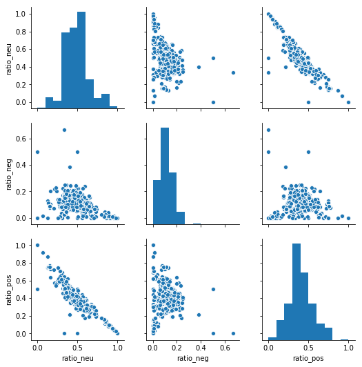
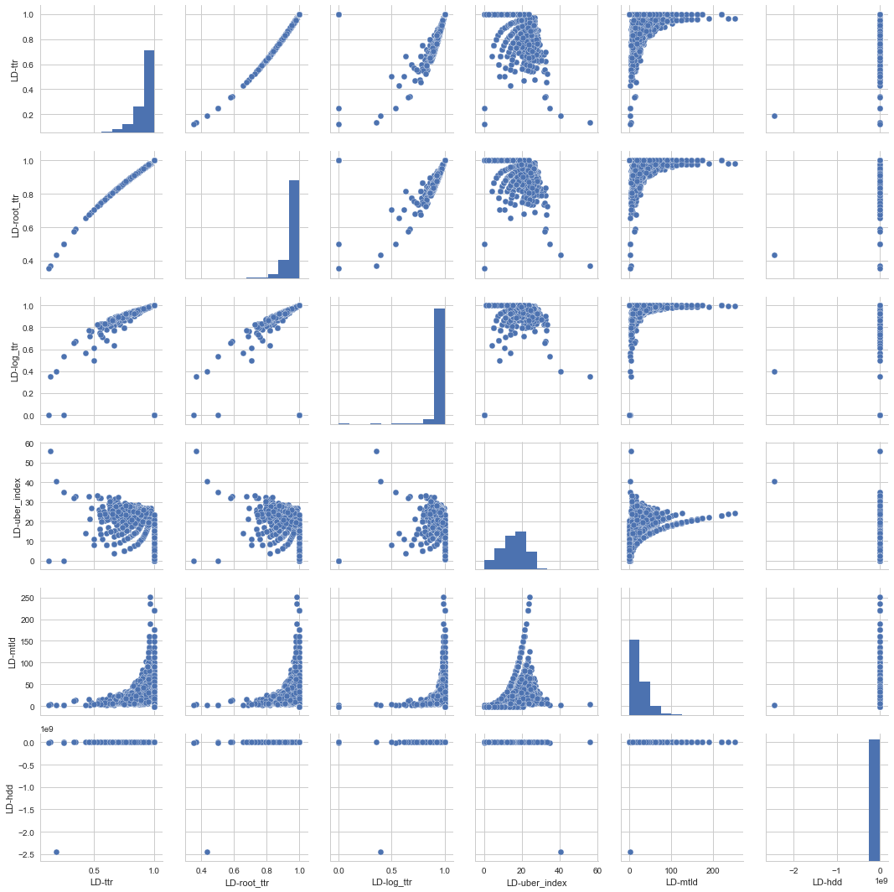

## Natural Language Processing (NLP) Features and Analysis


### Summary

 We used several Natural Language Processing (NLP) techniques to create metadata about the human language component of the tweet text. 18 NLP features were generated based on sentiment analysis, emotional analysis and topic modeling. Of those 18, the following 9 were selected as predictors for the models:

* sentiment_negative
* sentiment_neutral
* sentiment_positive
* token_count
* ant
* fear
* joy
* trust
* ratio_neg
* LD-mtld
* LD-HD-D
* LD-Yule-k
* LD-uber_index

### Loading/Cleaning the  Data

A fundamental component in performing Natural Language Processing is having clean text data.To clean our data, we used a combination of custom and pre-built functions to clean the tweet data for NLP. Our analysis focused on English language lexicons and models built on English language data, so in addition to lemmatizing the words, and removing stopwords, punctuation, urls and url encoding, we detected language and filtered out non-english words. The full code for these methods may be found in our Notebooks tab.


### Feature Engineering and Descriptions
We used various methods from langdetect, nltk, textblob, sklearn and customized open source code to perform our processing and analysis.

#### Linguistic Features
The **lexical diversity** score indicates how many different words are used within a body of text. The lexical diversity consists of the set of unique words in a tweet divided by the total number of tweets. The **token_count** and **url_token_ratio** are numeric fields that count how many tokens are in a tweet and have the ratio for urls to tokens per tweet. These fields are used to characterize how long the tweet is and also indicate the composition of the tweet in terms of words vs links to media (other websites, images, music, etc). The idea behind this feature was thinking that bots would be built to promote other media, not original ideas. The **url_token_ratio** was eliminated as a feature because it highly correlated with token counts and was also identified as a low-variance feature.

Listed below are some more sophisticated techniques that were generated to measure Lexical Diversity. Some were ruled out due to high correlation, as discussed in the feature analysis section.

**ttr**- The Type-Token Ratio represents the most used and intuitive way to measure lexical diversity on the basis of word repetition patterns. TTR consists in expressing the number of different words “as a proportion of the total number of words.” The higher the probability that a new word token is also a new word type, the closer the TTR is to 1, and the greater the lexical diversity of that text. In the case of lexical diversity measurement, a common strategy used to cope with sample size dependency consists in finding an adequate mathematical expression of the type count slowdown in order to counterbalance its effect on the TTR.

**root_ttr** - Various attempts were made in this regard: some studies assumed that the ratio fall is proportional to the square root of the token count

**log_ttr** - Attempt to ‘linearize’ the same ratio fall through various logarithmic transformations

**mtld** - Strategy that has so far successfully dealt with the sample size dependency of the TTR or any TTR-based measure consists in controlling for sample upsizing through fixed size sampling procedures.

**HD-D** - Index derived directly from the hypergeometric distribution

**Yule-k** - The measure of lexical repetition constitutes one of the variables used to determine the lexical diversity of texts.Although most of the constants for lexical richness actually depend on text length, Yule’s characteristic is considered to be highly reliable for being text length independent

**uber-index** - a logarithmic transformation of the TTR

The following code created our linguistic features. We created the *token_count* and *url_token_ratio* features.

```python
#compute new features: token count and url to token ratio
tweets_all['token_count'] = tweets_all.loc[:,'text'].apply(lambda x: len(x))

tweets_all['url_token_ratio'] = tweets_all['num_urls']/tweets_all['token_count']
```

The lexical diversity fields were also generated.

```python
#compute new features: ttr, yule's k, uber index,

from collections import Counter, defaultdict
from math import sqrt, log
from nltk import word_tokenize
import numpy as np
import pandas as pd

import os

def ttr(text):
    tok_text = word_tokenize(text)
    return len(set(tok_text)) / len(tok_text)

def root_ttr(text):
    return sqrt(ttr(text))

def corrected_ttr(text):
    tok_text = word_tokenize(text)
    return sqrt(len(set(tok_text)) / (2 * len(tok_text)))

def log_ttr(text):
    tok_text = word_tokenize(text)
    if log(len(tok_text),2) == 0:
        print(text)
        return 0
    return log(len(set(tok_text)),2) / log(len(tok_text),2)

def uber_index(text):
    tok_text = word_tokenize(text)
    if log(len(tok_text),2) != 0 and log(len(set(tok_text)),2) != 0:
        return (log(len(tok_text),2) ** 2) / (log(len(set(tok_text)),2) / log(len(tok_text),2))
    else:
        return 0

def yule_s_k(text):
    tok_text = word_tokenize(text)
    token_counter = Counter(tok.upper() for tok in tok_text)
    m1 = sum(token_counter.values())
    m2 = sum([freq ** 2 for freq in token_counter.values()])
    if m2-m1 != 0:
        i = (m1*m1) / (m2-m1)
        k = 10000 / i
        return k


```

```python

#Copyright 2017 John Frens
#
#Permission is hereby granted, free of charge, to any person obtaining a copy of this software and associated documentation files (the "Software"), to deal in the Software without restriction, including without limitation the rights to use, copy, modify, merge, publish, distribute, sublicense, and/or sell copies of the Software, and to permit persons to whom the Software is furnished to do so, subject to the following conditions:

import string

# Global trandform for removing punctuation from words
remove_punctuation = str.maketrans('', '', string.punctuation)

# MTLD internal implementation
def mtld_calc(word_array, ttr_threshold):
    current_ttr = 1.0
    token_count = 0
    type_count = 0
    types = set()
    factors = 0.0

    for token in word_array:
        token = token.translate(remove_punctuation).lower() # trim punctuation, make lowercase
        token_count += 1
        if token not in types:
            type_count +=1
            types.add(token)
        current_ttr = type_count / token_count
        if current_ttr <= ttr_threshold:
            factors += 1
            token_count = 0
            type_count = 0
            types = set()
            current_ttr = 1.0

    excess = 1.0 - current_ttr
    excess_val = 1.0 - ttr_threshold
    factors += excess / excess_val
    if factors != 0:
        return len(word_array) / factors
    return -1

# MTLD implementation
def mtld(word_array, ttr_threshold=0.72):
    word_array = word_tokenize(word_array)

    return (mtld_calc(word_array, ttr_threshold) + mtld_calc(word_array[::-1], ttr_threshold)) / 2


# HD-D internals

# x! = x(x-1)(x-2)...(1)
def factorial(x):
    if x <= 1:
        return 1
    else:
        return x * factorial(x - 1)

# n choose r = n(n-1)(n-2)...(n-r+1)/(r!)
def combination(n, r):
    r_fact = factorial(r)
    numerator = 1.0
    num = n-r+1.0
    while num < n+1.0:
        numerator *= num
        num += 1.0
    return numerator / r_fact

# hypergeometric probability: the probability that an n-trial hypergeometric experiment results
#  in exactly x successes, when the population consists of N items, k of which are classified as successes.
#  (here, population = N, population_successes = k, sample = n, sample_successes = x)
#  h(x; N, n, k) = [ kCx ] * [ N-kCn-x ] / [ NCn ]
def hypergeometric(population, population_successes, sample, sample_successes):
    return (combination(population_successes, sample_successes) *\
            combination(population - population_successes, sample - sample_successes)) /\
            combination(population, sample)

# HD-D implementation
def hdd(word_array, sample_size=42.0):
    word_array = word_tokenize(word_array)

    # Create a dictionary of counts for each type
    type_counts = {}
    for token in word_array:
        token = token.translate(remove_punctuation).lower() # trim punctuation, make lowercase
        if token in type_counts:
            type_counts[token] += 1.0
        else:
            type_counts[token] = 1.0
    # Sum the contribution of each token - "If the sample size is 42, the mean contribution of any given
    #  type is 1/42 multiplied by the percentage of combinations in which the type would be found." (McCarthy & Jarvis 2010)
    hdd_value = 0.0
    for token_type in type_counts.keys():
        contribution = (1.0 - hypergeometric(len(word_array), sample_size, type_counts[token_type], 0.0)) / sample_size
        hdd_value += contribution

    return hdd_value
```

#### Emotional Analysis Based Features

The **ant**, **disgust**, **fear**, **joy**, **sadness**, **surprise**, and **trust** features are boolean fields that indicate whether these emotions are  related to a given tweet. These assessments are created by comparing tweet tokens (words) with the EmoLex, the National Research Council (NRC) of Canada's Word-Emotion Association Lexicon. The EmoLex contains a mapping of words to emotions. If words within tweets have associated emotions within EmoLex, this would flag a 1 for the respective emotion feature. Discarded fields due to low-variance include **disgust**, **sadness**, and **surprise**. We suspect that the emotions that remained are expressed in tweets more than those that were excluded.

To label tweets with emotion, we compared the tweet text with emoLex, the lexicon built by the NRC that maps words to their emotion. This created boolean fields indicating anticipation, disgust, fear, joy, sadness, surprise and trust.

```python
def checkemo(x, emotions_list):
    words = re.sub("[^\w]", " ",  x).split()
    flag = 0
    matches = set(words) & set(emotions_list)
    if len(matches) > 0:
        flag = 1
    return(flag)

for key,values in feelings.items():
    tweets_all[key] = tweets_all.loc[:,'text'].apply(lambda x: checkemo(x,values))
```


#### Sentiment Analysis Based Features
The **sentiment_neutral**, **sentiment_positive**, and **sentiment_negative** features are boolean fields that indicate the sentiment predicted for a given tweet. These predictions were computed using built-in methods of the textblob module, an nltk wrapper. In particular the sentiment polarity method predicts sentiment based on a Bayesian model trained on a labeled corpus of movie reviews. We also computed the ratios for each sentiment seen across each user's body of tweets. These features were called **ratio_pos**, **ratio_neg** and **ratio_neu**. Feature selection eliminated the **ratio_pos** and **ratio_neu** which exhibited a positive linear correlation.


Again, for Sentiment Analysis, we used the textblob sentiment and polarity module to tag the text as having a positive, negative or neutral sentiment. At the user level, we also computed the ratio of positive, negative and neutral sentiment fields and applied these to the tweets.

```python
#get sentiment
def sentiment(text):
    sentiment = get_tweet_sentiment(text)
    return sentiment

def compute_sentiment_percentages(df, text_col, user_id_col):
    #measure sentiment, then create dummy variables    
    df['sentiment'] = df[text_col].astype(str).apply(lambda x: sentiment(x))
    df = pd.get_dummies(df, columns=['sentiment'])
    return df

#Sentiment Analysis --> creates positive/negative/neutral sentiment
tweets_all = compute_sentiment_percentages(tweets_all, 'text','user_id')
```

#### Topic Model Based Features
The **jaccard** feature consists of a rough jaccard similarity score that compares a user's top 10 topics with the top 10 topics generated from a sample of bots. The topics were derived using Non-negative Matrix Factorization to highlight the most important topics from the user's corpus of tweets. These were applied as an enrichment to the individual tweet. The **perc_in_bot_topic** feature indicates the ratio of words from an individual tweet that were also found in the top 10 bot topics to the total number of words within the tweet. The **perc_in_bot_topic** did not produce non-zero results so was eliminated as a feature. With the low number of words in tweets, comparing individual tweets to a set of topics was not practical.


To compute our two topic-model based features, we first compute the top 10 topics from a sample of bots. We used Non-negative Matrix Factorization (NMF) as an unsupervised way to identify the major topics from which a body of a users tweets is composed. The function below uses tf-idf to further filter stop words, common words (seen in 95% or more of the tweets), or highly unique (seen in only 1 text).

```python
def get10topics(x):
# Function adapted from sklearn tutorial code
# originally written by
# Author: Olivier Grisel <olivier.grisel@ensta.org>
#         Lars Buitinck
#         Chyi-Kwei Yau <chyikwei.yau@gmail.com>
# License: BSD 3 clause
    n_samples = len(x)
    n_features = 1000
    n_components = 10
    n_top_words = 20
    top_word_list = []


    def get_top_words(model, feature_names, n_top_words):
        top_word_list = []

        for topic_idx, topic in enumerate(model.components_):
            message = ''
            message += " ".join([feature_names[i] for i in topic.argsort()[:-n_top_words - 1:-1]])

            top_word_list.append(message)

        return top_word_list

# Load the tweets and vectorize. Use Term Frequency-Inverse Document Frequency
# To further filter out common words. This syntax removes english stop words
# and words occurring in only one document or at least 95% of the documents.

    error_cnt=0
    try:
        data_samples = x

        tfidf_vectorizer = TfidfVectorizer(max_df=0.95, min_df=2,
                                           max_features=n_features,
                                           stop_words='english')
        tfidf = tfidf_vectorizer.fit_transform(data_samples)


        # Fit the NMF model

        nmf = NMF(n_components=n_components, random_state=1, alpha=.1, l1_ratio=.5).fit(tfidf)

        #print("\nTopics in NMF model (Frobenius norm):")
        tfidf_feature_names = tfidf_vectorizer.get_feature_names()

        top_word_list=get_top_words(nmf, tfidf_feature_names, n_top_words)
    except:
        top_word_list = []

    return top_word_list
```


We used these functions to topic model each individual bot user, then combine all the bot topics together to create a final top 10 for all the bots


##### Percent of a tweet's word also found in bot topics

Next, we compared each individual tweet against the bot topics. We created a score that gives the ratio for words from the tweet also seen in bot topics divided by the total number of words in the tweet. This value is indicated in the **'perc_in_bot_topics'**.


```python
def percent_tweet_in_bot_topics(clean_text,bots_topics):
    #https://towardsdatascience.com/overview-of-text-similarity-metrics-3397c4601f50
    bot_string = ''
    for topic in bots_topics:
        bot_string = bot_string + topic + " "
    a = set(str(clean_text).split())
    b = set(bot_string.split())
    try:
        len_clean_text = len(a)
        score = a.intersection(b)
        percent_in_tweet = total/len_clean_text  
    except:
        percent_in_tweet = 0
    return percent_in_tweet    

t0 = time()
tweets_all['perc_in_bot_topic'] = tweets_all.loc[:,'clean_text'].apply(lambda x: percent_tweet_in_bot_topics(x, tweets_bots_final))
print("done in %0.3fs." % (time() - t0))
```

Unfortunately, this metric returned 0 for every record. Because the individual tweets are so short, we suspect that comparing the individual tweet's tokens with the bot topics is not a good metric.

##### Jaccard score

To compute the similarity between an individual user's top 10 topics with the bot topics, we computed a Jaccard Score. Recall that we calculated the top 10 bot topics, so the next step was to compute the top 10 topic models for each user.

```python
t0 = time()
tweets_grouped = tweets_all.groupby('user_id').agg(lambda x: x.tolist())
tweets_grouped = tweets_grouped.reset_index()
tweets_grouped['topics'] = tweets_grouped.loc[:,'clean_text'].apply(lambda x: get10topics(x))
print("done in %0.3fs." % (time() - t0))
```

Next we computed the Jaccard score, which indicates how much the user and bot's topics overlap, then merged this data back in with the tweets data.

```python
def jaccard(x,bots_topics):
    #https://towardsdatascience.com/overview-of-text-similarity-metrics-3397c4601f50    
    def get_jaccard_sim(str1, str2):

        a = set(str1.split())
        b = set(str2.split())

        c = a.intersection(b)
        return float(len(c)) / (len(a) + len(b) - len(c))
    total = 0
    a=''
    b=''
    for a in x:
        for b in bots_topics:
            score = get_jaccard_sim(a,b)
        total += score
    return total/10    

tweets_grouped['jaccard'] = tweets_grouped.loc[:,'topics'].apply(lambda x: jaccard(x, tweets_bots_final))
tweets_grouped_final = tweets_grouped[['user_id','jaccard']]
tweets_final = pd.merge(tweets_all, tweets_grouped_final, on='user_id')
```


### Feature Selection

We used sklearn's VarianceThreshold method to identify low-variance features (features with mostly one value).


```python
def variance_threshold_selector(data, threshold=0.5):
    #https://stackoverflow.com/questions/39812885/retain-feature-names-after-scikit-feature-selection
    selector = VarianceThreshold(threshold)
    selector.fit(data)
    return data[data.columns[selector.get_support(indices=True)]]

    tweets_all_var = all_tweets_df[['retweet_count', 'favorite_count', 'num_hashtags', 'num_urls', 'num_mentions',\
                                     'user_type', 'sentiment_negative', 'sentiment_neutral', 'sentiment_positive',\
                                     'ratio_pos', 'ratio_neg', 'ratio_neu', 'token_count','url_token_ratio', \
                                     'ant','disgust', 'fear', 'joy', 'sadness', 'surprise', 'trust', 'jaccard','LD-ttr','LD-root_ttr','LD-corrected_ttr','LD-log_ttr','LD-uber_index','LD-yule_s_k','LD-mtld','LD-hdd']]

features = variance_threshold_selector(tweets_all_var, threshold=(.95*.1)).columns
```

Fields returned as meeting the variance threshold were the following:

    retweet_count
    favorite_count
    num_hashtags
    num_urls
    num_mentions
    user_type
    sentiment_negative
    sentiment_neutral
    sentiment_positive
    token_count
    ant
    fear
    joy
    trust
    LD-uber_index
    LD-yule_s_k
    LD-mtld
    LD-hdd


A scatter matrix plot indicates that a linear correlation exists between ratio_neu and ratio_neg. We will keep ratio_neg because it does not appear to be correlated.


```python
import seaborn as sns;
tweets_ratios = tweets_all_var[['ratio_neu', 'ratio_neg', 'ratio_pos']]
t_final_sample = resample(tweets_ratios, n_samples=5000, replace=False)
g = sns.pairplot(t_final_sample)
print('Scatter Matrix for Sentiment Ratio Values')
```


### Scatter Matrix for Sentiment Ratio Values




### Scatter Matrix for Linguistic Features

```python

import seaborn as sns;
tweets_ld = all_tweets[['LD-ttr', 'LD-root_ttr', 'LD-log_ttr','LD-uber_index','LD-yule_s_k','LD-mtld','LD-hdd']]
tweets_ld_sample = resample(tweets_ld, n_samples=5000, replace=False)
g = sns.pairplot(tweets_ld_sample)
print('Scatter Matrix for Lexical Diversity')
```

There is correlation between ttr, root_ttr , and log_ttr as expected. We ll use log_ttr as part of our features, apart from mtld, HD-D, Yule-k, as part of of our lexical diversity feature set.



```python

tweets_all_var = all_tweets_df[['retweet_count', 'favorite_count', 'num_hashtags', 'num_urls', 'num_mentions',\
                                 'user_type', 'sentiment_negative', 'sentiment_neutral', 'sentiment_positive',\
                                 'ratio_pos', 'ratio_neg', 'ratio_neu', 'token_count','url_token_ratio', \
                                 'ant','disgust', 'fear', 'joy', 'sadness', 'surprise', 'trust', 'jaccard','LD-ttr','LD-root_ttr','LD-corrected_ttr','LD-log_ttr','LD-uber_index','LD-yule_s_k','LD-mtld','LD-hdd']]

tweets_all_var[['LD-yule_s_k']] = tweets_all_var[['LD-yule_s_k']].fillna(0)

def convert_float(val):
    try:
        return float(val)
    except ValueError:
        return 0

tweets_all_var['LD-yule_s_k']=tweets_all_var['LD-yule_s_k'].apply(lambda x: convert_float(x))
tweets_all_var
features = variance_threshold_selector(tweets_all_var, threshold=(.95*.1)).columns
```

Features that are significant:

retweet_count, favorite_count, num_hashtags, num_urls, num_mentions, user_type, sentiment_negative, sentiment_neutral, sentiment_positive, token_count, ant, fear, joy, trust, LD-uber_index, LD-yule_s_k, LD-mtld, LD-hdd
